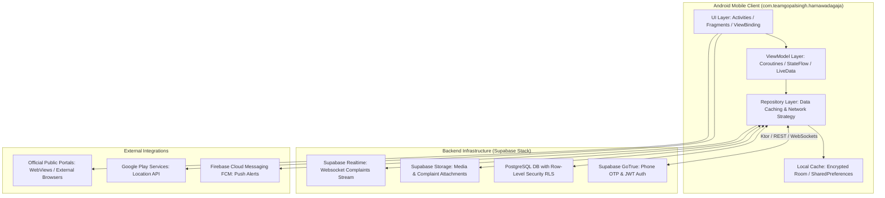

# 팀 गोपालसिंह – हरनावदा गजा (Team Gopal Singh - Harnawada Gaja)

[](https://developer.android.com)
[](https://kotlinlang.org)
[](https://supabase.com)
[](#)

> **Official Repository & Build Documentation**  
> **Package Identifier:** `com.teamgopalsingh.harnawadagaja`  
> **Scope:** Gram Panchayat Harnawada Gaja, Assembly Constituency Jhalrapatan (198), District Jhalawar, Rajasthan.  

---

## 📌 Executive Summary & Purpose

**"टीम गोपालसिंह – हरनावदा गजा"** is an independent, community-driven citizen engagement and civic facilitation Android application built specifically for the residents of Gram Panchayat Harnawada Gaja and surrounding villages in Jhalrapatan (198).

The platform empowers local citizens to:
1. **Report & Track Local Civic Grievances:** Register issues (electricity, water supply, sanitation, road damage) with geo-tagged photos and monitor resolution status in real time.
2. **Access Verified Village Updates:** Receive authentic news regarding Gram Panchayat development works, infrastructure projects, and welfare awareness camps.
3. **Emergency Telephone Directory:** Quick one-touch direct dialing to local health centers, police, ambulances, electricity fault line, and Panchayat representatives.
4. **Public Welfare Information Portal:** Learn about eligibility, required documentation, and official portal links for central and state welfare initiatives.
5. **Community Announcements:** Stay updated on village meetings, health checkup camps, sports tournaments, and social initiatives.

---

## 🏛️ NON-GOVERNMENTAL DISCLAIMER

```text
====================================================================================================
IMPORTANT LEGAL DISCLAIMER:
This application is an independent citizen information platform managed by Team Gopal Singh. 
This app is NOT affiliated with, endorsed by, sponsored by, or an official application of the 
Government of Rajasthan, Election Commission of India, CEO Rajasthan, or Rajasthan Sampark 181.
====================================================================================================
```

All government welfare scheme details presented in the app are compiled from publicly available official portals:
- [Rajasthan Sampark Portal](https://sampark.rajasthan.gov.in)
- [Department of Panchayati Raj, Rajasthan](https://rajpanchayat.rajasthan.gov.in)
- [Jan Soochna Portal, Rajasthan](https://jansoochna.rajasthan.gov.in)
- [Chief Electoral Officer (CEO), Rajasthan](https://ceorajasthan.nic.in)
- [District Administration Jhalawar](https://jhalawar.rajasthan.gov.in)

---

## 🏗️ System Architecture

The application adopts Modern Android Development (MAD) practices with Clean Architecture (MVVM) and Kotlin Coroutines, backed by a real-time Supabase serverless stack and Firebase Cloud Messaging (FCM).



---

## 📂 Repository Directory Structure

```
team_gopalsingh_app/
├── android_build_config/
│   ├── AndroidManifest.xml        # Package manifest, permissions, deep links & FileProvider
│   ├── build.gradle               # Unified project & app Gradle build configuration
│   ├── play_store_metadata.json   # Google Play Console store listing metadata (Hindi & English)
│   └── res/
│       └── xml/
│           └── file_paths.xml     # Secure FileProvider storage paths configuration
├── PRIVACY_POLICY.md              # Full legal privacy policy, terms & non-governmental disclaimer
└── README.md                      # Developer manual, architecture & deployment guide
```

---

## 🛠️ Local Development Setup

### Prerequisites
- **JDK:** Java Development Kit (JDK) 17 (Azul Zulu or Temurin recommended)
- **Android Studio:** Jellyfish (2023.3.1) or newer
- **Android SDK:** API Level 34 (Android 14)
- **Build Tools:** 34.0.0
- **Gradle:** 8.2+

### Step-by-Step Configuration
1. **Clone Repository:**
   ```bash
   git clone https://github.com/teamgopalsingh/harnawada-gaja-android.git
   cd team_gopalsingh_app
   ```
2. **Environment Variables Configuration:**
   Copy the example environment template or set the required Supabase keys in `local.properties`:
   ```properties
   # local.properties
   sdk.dir=/path/to/android/sdk
   SUPABASE_URL=https://xyzprojectid.supabase.co
   SUPABASE_ANON_KEY=eyJhbGciOiJIUzI1NiIsInR5cCI6IkpXVCJ9...
   ```
3. **Gradle Sync & Build:**
   Open the project in Android Studio and trigger a Gradle sync, or execute via terminal:
   ```bash
   ./gradlew clean assembleDebug
   ```

---

## 🗄️ Supabase Migration & Database Schema Guide

Execute the following SQL script in your Supabase SQL Editor to initialize tables, indexes, and Row-Level Security (RLS) policies:

```sql
-- Enable PostGIS extension for geo-location features
CREATE EXTENSION IF NOT EXISTS postgis;

-- 1. USERS PROFILE TABLE
CREATE TABLE IF NOT EXISTS public.profiles (
    id UUID PRIMARY KEY REFERENCES auth.users(id) ON DELETE CASCADE,
    phone_number TEXT UNIQUE NOT NULL,
    full_name TEXT NOT NULL,
    village_name TEXT DEFAULT 'Harnawada Gaja',
    gram_panchayat TEXT DEFAULT 'Harnawada Gaja',
    constituency TEXT DEFAULT 'Jhalrapatan (198)',
    created_at TIMESTAMPTZ DEFAULT NOW(),
    updated_at TIMESTAMPTZ DEFAULT NOW()
);

-- 2. CIVIC COMPLAINTS TABLE
CREATE TABLE IF NOT EXISTS public.complaints (
    id UUID PRIMARY KEY DEFAULT gen_random_uuid(),
    user_id UUID REFERENCES public.profiles(id) ON DELETE CASCADE,
    category TEXT NOT NULL, -- Electricity, Water, Road, Sanitation, Others
    title TEXT NOT NULL,
    description TEXT NOT NULL,
    status TEXT DEFAULT 'PENDING', -- PENDING, IN_PROGRESS, RESOLVED, REJECTED
    location_lat DOUBLE PRECISION,
    location_lng DOUBLE PRECISION,
    attachment_urls TEXT[],
    resolution_notes TEXT,
    created_at TIMESTAMPTZ DEFAULT NOW(),
    updated_at TIMESTAMPTZ DEFAULT NOW()
);

-- 3. VILLAGE ANNOUNCEMENTS & NEWS TABLE
CREATE TABLE IF NOT EXISTS public.announcements (
    id UUID PRIMARY KEY DEFAULT gen_random_uuid(),
    title TEXT NOT NULL,
    summary TEXT NOT NULL,
    content TEXT NOT NULL,
    category TEXT DEFAULT 'GENERAL', -- DEVELOPMENT, HEALTH, SCHEME, EVENT
    image_url TEXT,
    external_link TEXT,
    is_pinned BOOLEAN DEFAULT FALSE,
    published_at TIMESTAMPTZ DEFAULT NOW()
);

-- 4. EMERGENCY CONTACTS DIRECTORY
CREATE TABLE IF NOT EXISTS public.emergency_contacts (
    id UUID PRIMARY KEY DEFAULT gen_random_uuid(),
    service_name TEXT NOT NULL,
    contact_person TEXT,
    phone_number TEXT NOT NULL,
    category TEXT NOT NULL, -- POLICE, HEALTH, PANCHAYAT, ELECTRICITY, AMBULANCE
    display_order INT DEFAULT 0
);

-- ENABLE ROW LEVEL SECURITY (RLS)
ALTER TABLE public.profiles ENABLE ROW LEVEL SECURITY;
ALTER TABLE public.complaints ENABLE ROW LEVEL SECURITY;
ALTER TABLE public.announcements ENABLE ROW LEVEL SECURITY;
ALTER TABLE public.emergency_contacts ENABLE ROW LEVEL SECURITY;

-- RLS POLICIES
-- Profiles: Users can view and update their own profile
CREATE POLICY "Users view own profile" ON public.profiles FOR SELECT USING (auth.uid() = id);
CREATE POLICY "Users update own profile" ON public.profiles FOR UPDATE USING (auth.uid() = id);

-- Complaints: Users can view & create their own complaints
CREATE POLICY "Users view own complaints" ON public.complaints FOR SELECT USING (auth.uid() = user_id);
CREATE POLICY "Users insert complaints" ON public.complaints FOR INSERT WITH CHECK (auth.uid() = user_id);

-- Announcements & Emergency Contacts: Public Read Access
CREATE POLICY "Public announcements read" ON public.announcements FOR SELECT USING (true);
CREATE POLICY "Public emergency contacts read" ON public.emergency_contacts FOR SELECT USING (true);

-- STORAGE BUCKETS SETUP
INSERT INTO storage.buckets (id, name, public) 
VALUES ('complaint-attachments', 'complaint-attachments', true)
ON CONFLICT (id) DO NOTHING;

INSERT INTO storage.buckets (id, name, public) 
VALUES ('announcements-media', 'announcements-media', true)
ON CONFLICT (id) DO NOTHING;
```

---

## 🚀 Build & Deployment Instructions

### 1. Generating Debug APK
To build a local testing APK:
```bash
./gradlew assembleDebug
```
Output path: `app/build/outputs/apk/debug/app-debug.apk`

### 2. Generating Release APK & Production AAB Bundle
Set up release signing credentials in environment variables:
```bash
export KEYSTORE_FILE="/path/to/release-key.jks"
export KEYSTORE_PASSWORD="YourStrongKeystorePassword"
export KEY_ALIAS="team_gopalsingh_alias"
export KEY_PASSWORD="YourStrongKeyPassword"

# Generate Release APK
./gradlew assembleRelease

# Generate Android App Bundle (AAB) for Google Play Console
./gradlew bundleRelease
```
Output paths:
- **Release APK:** `app/build/outputs/apk/release/app-release.apk`
- **Play Store AAB:** `app/build/outputs/bundle/release/app-release.aab`

---

## 🔍 Quality Assurance & Play Store Verification Checklist

Before submitting to Google Play Console, verify compliance against the following checklist:

- [x] **Package Name & Application ID:** `com.teamgopalsingh.harnawadagaja` matches in Manifest, Gradle, and Play Console.
- [x] **SDK Targets:** `minSdk = 21` (supports 99%+ active Android devices), `targetSdk = 34` (Android 14 compliance).
- [x] **Non-Governmental Disclaimer:** Prominently featured in Play Store Metadata (`play_store_metadata.json`), Privacy Policy (`PRIVACY_POLICY.md`), and App Navigation Drawer.
- [x] **Location Permission Compliance:** `ACCESS_FINE_LOCATION` requested dynamically with explicit in-app disclosure prior to permission prompt.
- [x] **Account Deletion Link:** Functioning web portal live at `https://teamgopalsingh.org/delete-account`.
- [x] **ProGuard & Resource Shrinking:** Verified `minifyEnabled true` and `shrinkResources true` build without runtime reflection crashes.
- [x] **FileProvider Security:** `file_paths.xml` prevents arbitrary file path leaks.

---

## ✉️ Maintainer & Support Contact

**Team Gopal Singh (Citizen Information Platform)**  
Gram Panchayat Harnawada Gaja, Tehsil Jhalrapatan (198), District Jhalawar, Rajasthan - 326015  
- **Email:** [contact@teamgopalsingh.org](mailto:contact@teamgopalsingh.org)  
- **Website:** [https://teamgopalsingh.org](https://teamgopalsingh.org)  
- **Privacy Policy:** [https://teamgopalsingh.org/privacy-policy](https://teamgopalsingh.org/privacy-policy)  
